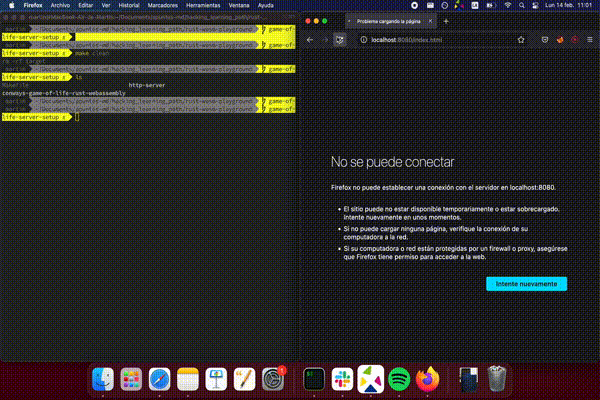

# Rust + Wasm playground

## How to run

First, you have to choose what server do you want to use for hosting the wasm game of life, you can choose between three different implementations using three different libraries: Crossbeam, Async-std or Tokio. Whichever you choose the functionalities are the same.
- `make start_tokio_web`
- `make start_crossbeam_web`
- `make start_async_std_web`

This will compile the wasm file, the web server binary, and bundle everything in the target directory. In the end it will start the server up as shown here:

